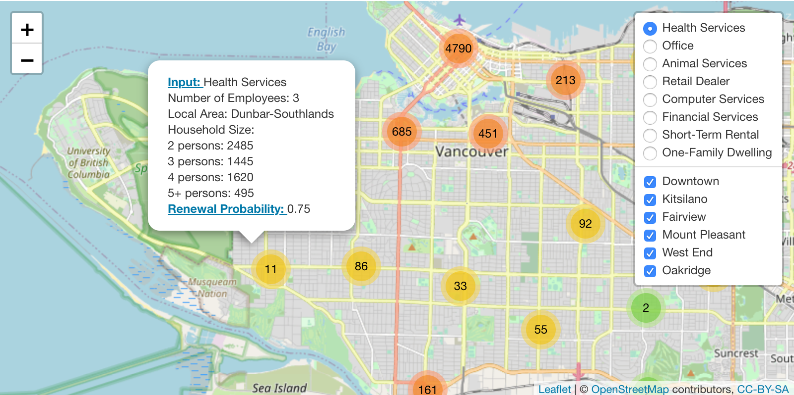

<div align="center">

# Forecasting the Evolution of <br> Vancouver's Business Landscape

</div>

## Summary

In the continuing age of digital revolution, data is used ubiquitously among industries and individuals. Everyday problems, such as finding the quickest route home and tracking food deliveries, have been effectively tackled by data. The same approach could be implemented in the public sector, helping to inform policy decisions and future planning. 

With COVID-19 governing our economy and lifestyle, it is critical to understand the evolution of the city’s neighbourhoods and leverage that to predict potential future outcomes. One way to approach this problem, is to track the evolution of businesses in Vancouver’s diverse neighbourhoods and develop/extract meaningful insights. 

To address this we have defined the following research questions for the project: 

* Will a business renew their license in the coming year?  
* Geospatial summary of Vancouver's business landscape


## Table of Contents
- [Contributing](#contributing)
- [Contributors](#Contributors)
- [How to use this repository](#how-to-use-this-repository)
- [Data Requirements](#data-requirements)
- [Usage](#usage)
- [Data Products](#data-products)
- [Examples](#examples)
- [Package Dependencies](#package-dependencies)
- [License](#license)


## Contributing

Contribution will not be open to public. Contributors please feel free to [open an issue](https://github.com/deetken/evan/issues/new) or send a pull request to report bugs or add features.

### Contributors

UBC Data Science Team:

* Aakanksha Dimri
* Jasmine Qin
* Keanna Knebel
* Xinwen Wang

Mentor:

* Simon Goring

Deetken Team:

* Tom Reimer
* Kristiana Powell


## How to use this repository

Navigation of files and descriptions of directory structure in the repository. Specific commands will be given in Usage section and example usage will be given in Examples section. 


## Data Requirements

The primary dataset utilized in this project consists of all Vancouver Business Licence applications from 1997 to the current date. This data is made available as part of the city of Vancouver’s [Open Data Portal](https://opendata.vancouver.ca/pages/home/) and regulated under the terms of the [Open Government Licence – Vancouver](https://opendata.vancouver.ca/pages/licence/). The most pertinent features present in this dataset are business type, location, and number of employees.

In addition to the business licence dataset, the Canadian census surveys provide another important source of data for this project. The census data is hosted on the Vancouver Open Data Portal and provides demographic information, such as population density, average income, age distribution, and ethnicity. The current census dataset aggregates the demographic data by Vancouver neighbourhoods. As the project progresses, we may choose to further refine our model by obtaining census data aggregated at the postal code level.


## Usage

### 1. Using Bash/Terminal 

To replicate the analysis performed in this project, clone this GitHub repository, install the required [dependencies](#package-dependencies) listed below, and run the following commands in your command line/terminal from the root directory of this project:


```{bash}
# 1. 01_download_data.py

python src/01_download_data.py --file_path="data/raw" \
--urls="[(licence_1997_2012.csv, \
https://opendata.vancouver.ca/explore/dataset/business-licences-1997-to-2012/download/?format=csv&timezone=America/Los_Angeles&lang=en&use_labels_for_header=true&csv_separator=%3B), \
(licence_2013_current.csv, \
https://opendata.vancouver.ca/explore/dataset/business-licences/download/?format=csv&timezone=America/Los_Angeles&lang=en&use_labels_for_header=true&csv_separator=%3B), \
(census_2016.csv, \
https://webtransfer.vancouver.ca/opendata/csv/CensusLocalAreaProfiles2016.csv), \
(census_2011.csv, \
https://webtransfer.vancouver.ca/opendata/csv/CensusLocalAreaProfiles2011.csv), \
(census_2006.csv, \
https://webtransfer.vancouver.ca/opendata/csv/CensusLocalAreaProfiles2006.csv), \
(census_2001.csv, \
https://webtransfer.vancouver.ca/opendata/csv/CensusLocalAreaProfiles2001.csv), \
(local_area_boundary.geojson, \
https://opendata.vancouver.ca/explore/dataset/local-area-boundary/download/?format=geojson&timezone=America/Los_Angeles&lang=en),\
(parking-meters.csv, \
https://opendata.vancouver.ca/explore/dataset/parking-meters/download/?format=csv&timezone=America/Los_Angeles&lang=en&use_labels_for_header=true&csv_separator=%3B),\
(disability-parking.csv, \
https://opendata.vancouver.ca/explore/dataset/disability-parking/download/?format=csv&timezone=America/Los_Angeles&lang=en&use_labels_for_header=true&csv_separator=%3B),\
(14100096-eng.zip, \
https://www150.statcan.gc.ca/n1/tbl/csv/14100096-eng.zip),\
(14100327-eng.zip, \
https://www150.statcan.gc.ca/n1/tbl/csv/14100327-eng.zip),\
(vancouver_empolyment_2020.csv, \
https://www150.statcan.gc.ca/t1/tbl1/en/dtl!downloadDbLoadingData-nonTraduit.action?pid=1410029401&latestN=5&startDate=&endDate=&csvLocale=en&selectedMembers=%5B%5B18%2C43%2C31%2C27%2C45%2C9%2C13%2C3%2C15%2C14%2C26%2C17%2C42%2C37%2C20%2C39%2C19%2C35%2C28%2C12%2C40%2C25%2C30%2C29%2C8%2C2%2C33%2C11%2C38%2C16%2C5%2C41%2C4%2C34%2C10%2C7%2C44%2C23%2C1%2C22%2C6%2C36%2C21%2C24%2C46%2C32%5D%2C%5B5%5D%2C%5B1%5D%2C%5B1%5D%5D)]"

# 2. 02_process_data.R

Rscript src/02_process_data.R --filepath_in="data/raw" \
--filepath_out="data/processed" \
--filename_1="licence_1997_2012.csv" \
--filename_2="licence_2013_current.csv"


# 3. 03_clean_wrangle.py

python3 src/03_clean_wrangle.py --file_path="data/processed/train.csv" --save_to="data/processed/train_cleaned.csv"
python3 src/03_clean_wrangle.py --file_path="data/processed/validate.csv" --save_to="data/processed/validate_cleaned.csv"
python3 src/03_clean_wrangle.py --file_path="data/processed/test.csv" --save_to="data/processed/test_cleaned.csv"
python3 src/03_clean_wrangle.py --file_path="data/processed/combined_licences.csv" --save_to="data/processed/combined_licences_cleaned.csv"

# 4. 04_wrangle_synthesis.py
python3 src/04_wrangle_synthesis.py --file_path1="data/raw/disability-parking.csv" --file_path2="data/raw/parking-meters.csv" --file_path3="data/processed/train_cleaned.csv" --file_path4="data/raw/14100096-eng.zip" --file_path5="data/raw/14100327-eng.zip"  --save_to1="data/processed/combined_train.csv" --save_to2="data/processed/parking_meter_vis.csv" --save_to3="data/processed/disability_parking_vis.csv" --save_to4="data/processed/licence_vis.csv"

# 5. 05_kepler_vis.py
python3 src/05_kepler_vis.py --file_path1="data/processed/licence_vis.csv" --file_path2="data/processed/disability_parking_vis.csv" --file_path3="data/processed/paking_meter_vis.csv" 
```

## Data Products

*Description or screenshot of end products and where to find them*

The proposed final product consists of a data pipeline, as well as, a geospatial visualization of Vancouver's business landscape. Users will be able to locate a specific zone on the interactive map and view relevant descriptive information, such as business type distribution and census data [**figure 1**]. The data pipeline will pass processed input data of a specific business to a machine learning model and produce a predicted renewal probability.



## Examples

*Specific illustration of how to use the end product*


## Package Dependencies

### Python 3.7 and Python packages:

- docopt 
- pandas 
- os
- re
- requests

### R 3.6 and R packages:

- data.table
- docopt
- tidyverse
- rgdal
- timevis
- leaflet


## License
