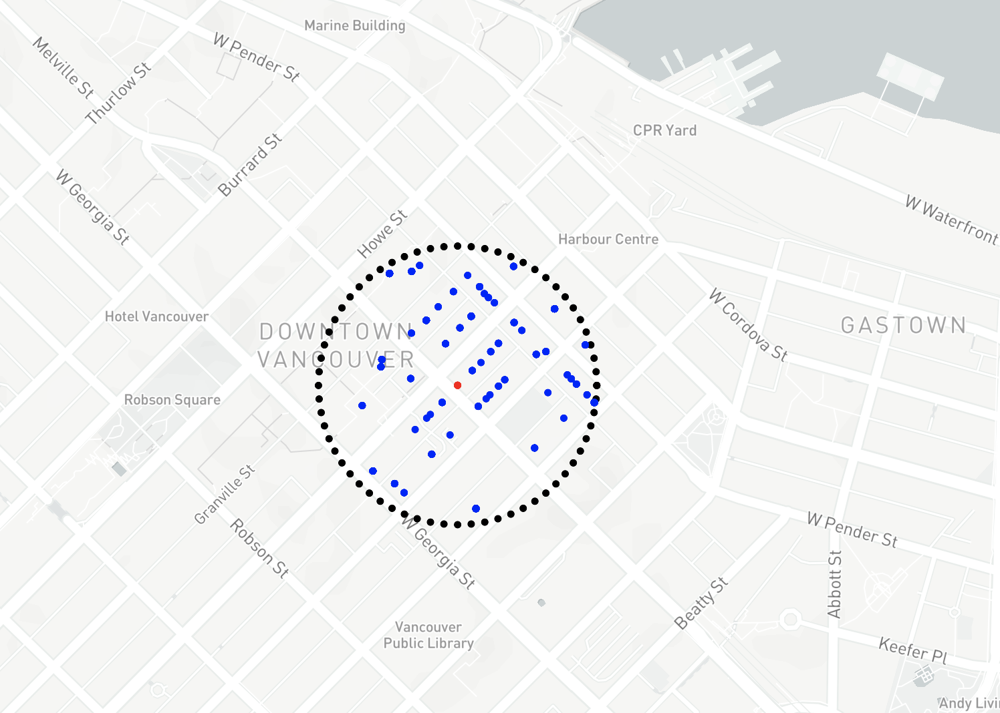
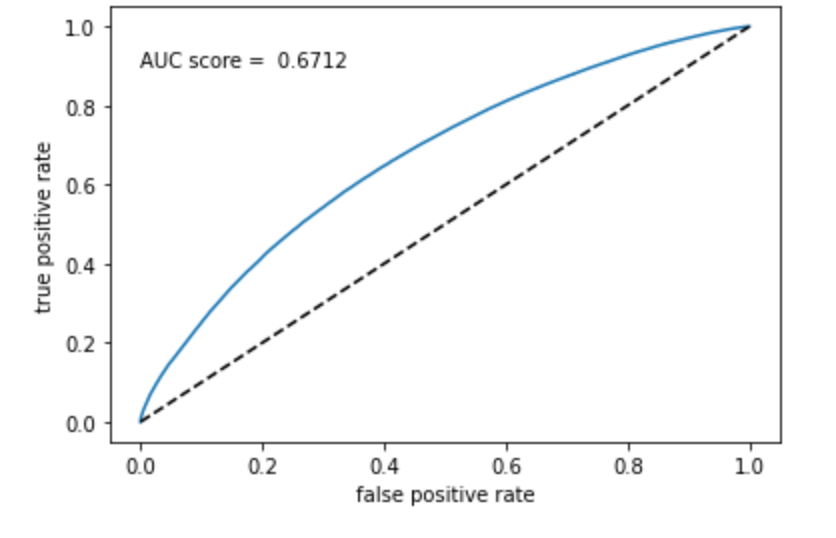
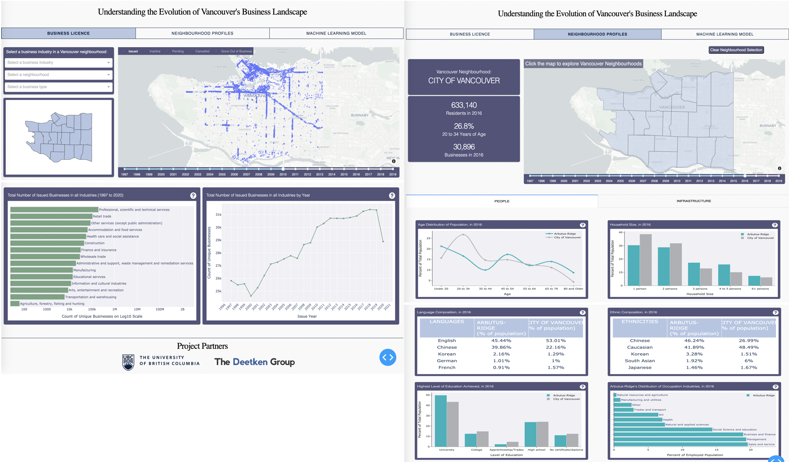

---
output:
  pdf_document: default
  html_document: default
bibliography: project_refs.bib
---
---
title: |
  | \vspace{5cm} \Large \textbf{Understanding the Evolution of Vancouver's Business Landscape}
subtitle: |
  | \vspace{0.5cm} UBC MDS Capstone Project Final Report
  | \vspace{0.5cm}
author: |
  | \vspace{0.5cm} Aakanksha Dimri, Keanna Knebel, Jasmine Qin, Xinwen Wang
  | \vspace{0.5cm} Mentor: Simon Goring
date: "Date: 2020/06/29"
output: pdf_document
geometry: "left=2cm,right=2cm,top=2cm,bottom=2cm"
linkcolor: "blue"
nocite: "@*"
header-includes:
  - \usepackage{titling}
  - \pretitle{\begin{center}
    \includegraphics[width=7in,height=9in]{../../figures/logo.png}\LARGE\\}
  - \posttitle{\end{center}}
---

\newpage


```{r setup, include=FALSE}
knitr::opts_chunk$set(echo = TRUE)
library(tidyverse)
library(gridExtra)
licence <- read_csv("../../data/processed/03_cleaned_train.csv")
census <- read_csv("../../data/processed/census_viz.csv")
```

# Executive Summary
With a rising demand for future social services planning in Vancouver, the goal of this project is to provide data-driven strategies for individual businesses, as well as, a broader understanding of resource allocations across neighbourhoods. To achieve this, we used a wide range of machine learning methodologies to (1) develop a model to predict whether a business will renew its licence and (2) provide a geospatial summary of the business licence history and the constructed model. Light-GBM, a gradient boosting decision tree model, was fit with business licence data and census data to predict the likelihood of renewal. The final model has an accuracy of 0.60 and a recall of 0.64 (non-renewed licences). The project workflow is reproducible, utilizes solely open-source data, and hosted in a private [GitHub repository](https://github.com/deetken/evan). The final data product is designed to synthesize diverse datasets, allowing end-users to input additional data reflective of their own specific objectives. Thus, despite its limitations in regards to predictive capabilities, the final data product serves as a solid foundation for understanding Vancouver’s evolving business landscape.


# Introduction
Strategic urban planning provides a framework for achieving socio-economic objectives driven by actionable and sustainable development[@strategicplanning]. Centralized city plans serve to reach these objectives through the coordination of efforts from the government, the private sector, and the community[@strategicplanning]. Importantly, by planning and anticipating a community’s future needs, city leaders are better able to allocate municipal spending, mitigate potential risks, and capitalize on opportunities. 

Developing an effective strategic plan requires a critical assessment of a diverse set of factors, including budgetary constraints, local demand for social services, accessibility, employment, and housing. Accessible public data portals (e.g., [Vancouver Open Data](https://opendata.vancouver.ca/pages/home/)), in conjunction with data science techniques, represent one approach to assess these factors. In particular, developing an understanding of how Vancouver’s business landscape has evolved over time can provide insight into how to efficiently allocate the city’s resources and services. 

All businesses operating in the city of Vancouver must have a valid business licence which is required to be renewed every calendar year. As such, the collective set of business licences represents a yearly snapshot of the entire Vancouver business landscape. The renewal of business licences provides information regarding the spatial distribution, the temporal trends, and the volatility of businesses across Vancouver’s neighbourhoods. While licence renewal takes place on the individual business scale, it is likely influenced by broader regional factors, such as the proximity to public transport, the demographics of the neighbourhood, and the national economic health.

This project focuses on developing insight into Vancouver’s business landscape which can be leveraged by policy-makers, planners, business owners, and others to improve efficiency. To achieve this we have established two main research objectives. (1) We will generate a machine learning model to predict whether a business will renew its licence. Given a reasonable set of factors drawn from public data, we can also begin to interpret the model output to provide (2) a broader geospatial summary of the evolution of Vancouver's business landscape.

# Data Science Methods

## Descriptions and Justications
The primary datasets utilized in this project are Vancouver Business Licence applications (from 1997 to the current date) and the Canadian census surveys. These datasets are made available as part of the city of Vancouver's [Open Data Portal](https://opendata.vancouver.ca/pages/home/). The most pertinent features present in the business licence dataset are business type, location, and number of employees. The Canadian census surveys provides demographic information such as population density, average income, age distribution, and ethnicity.

One crucial initial step was to transform the unstructured chronological licence data into a machine-interpretable form. A research unit in this project is one unique business, identified by name and location. We further split these individual businesses into train, validation, and test sets ([02_split_licence.R](https://github.com/deetken/evan/blob/master/src/02_clean_wrangle/02_split_licence.R#L54)). To better answer the question of whether a business will renew its licence next year, annual observations of each business are lagged by one year to generate the response variable -- next year’s status ([03_clean_licence.py](https://github.com/deetken/evan/blob/master/src/02_clean_wrangle/03_clean_licence.py#L83)).

Synthesizing information across various datasets is another important step shared by both research questions. As shown in Figure 1, Vancouver neighbourhoods resemble micro-ecosystems, each with its own demographic characteristics which are constantly evolving. To extract valuable information from social variables, such as age group and transportation mode distributions, we have examined a total of 96 sub-categories of demographic variables for each census year. During this process of data integration, we have faced numerous challenges in cleaning data entry errors. Thus, we have implemented various wrangling techniques, such as regex and custom helper functions ([05_clean_census.py](https://github.com/deetken/evan/blob/master/src/02_clean_wrangle/05_clean_census.py)), to improve data consistency and pipeline reproducibility.

```{r census, fig.cap="Example Census Variables", fig.width=15, fig.height=6, echo=FALSE, fig.align="center"}

graph_config <- theme_minimal() +
  theme(axis.text.x = element_text(size=12),
        axis.text.y = element_text(size=12),
        legend.position="bottom",
        legend.box = "horizontal",
        axis.title=element_text(size=14),
        legend.text=element_text(size=14),
        legend.title=element_text(size=14))

age <- census %>% 
  filter(LocalArea=="Downtown" | LocalArea=="Kerrisdale") %>% 
  filter(Year==2016) %>% 
  select("LocalArea", "Under 20", "20 to 34", "35 to 44",
         "45 to 54", "55 to 64", "65 to 79", "80 and Older") %>%
  gather("age", "percentage", -LocalArea) %>%
  mutate(age=factor(age, levels=c("Under 20", "20 to 34", "35 to 44",
         "45 to 54", "55 to 64", "65 to 79", "80 and Older"))) %>% 
  ggplot(aes(x=age, y=percentage, color=LocalArea, group=LocalArea)) +
  geom_point() +
  geom_path() +
  graph_config +
  labs(x="Age Sub-Categories Distribution in Downtown and Kerrisdale in 2016", y="Percentage of Total Population") +
  scale_color_manual(values=c("#862699", "#008C29"))

transportation <- census %>% 
  filter(LocalArea=="Downtown") %>% 
  select('Year',
         'car as driver',
         'car as passenger',
         'public transportation',
         'walked',
         'bicycle',
         'other transportation') %>% 
  rename('Car, as Driver'='car as driver',
         'Car, as Passenger'='car as passenger',
         'Public Transportation'='public transportation',
         'Walk'='walked',
         'Bicycle'='bicycle',
         'Other'='other transportation') %>%
  mutate(Year=factor(Year)) %>% 
  gather("transportation", "percentage", -Year) %>%
  mutate(transportation=factor(transportation, levels=c('Car, as Driver', 'Walk',
                                  'Public Transportation',
                                  'Bicycle',
                                  'Car, as Passenger',
                                  'Other'))) %>% 
  ggplot(aes(x=transportation, y=percentage, fill=Year)) +
  geom_bar(stat="identity", position=position_dodge()) +
  labs(x="Mode of Transportation Sub-Categories Distribution in Downtown by Year", y="") +
  theme_minimal() +
  graph_config + 
  scale_fill_brewer(palette="PRGn")

grid.arrange(age, transportation, nrow = 1)
```

The dataset contains more instances of renewed licences (BR) in comparison to non-renewed licences (BNR), which implies class imbalance. Therefore, along with accuracy, recall score is also an important evaluation metric (predicted BNR over actual BNR). By using recall as an evaluation metric, we are more conservative about making a false sense of success for business owners.

```{r nearby_business, fig.cap="Nearby Similar Businesses", out.width="250px", out.height="200px", echo=FALSE, fig.align="center"}

```

The project relies strongly on both temporal and spatial variables, as such, it is important to generate features which provide a better representation of the available data. ([07_feature_engineering.py](https://github.com/deetken/evan/blob/master/src/03_modelling/07_feature_engineering.py)). To enrich geo-spatial configuration around businesses, we have constructed two pieces of additional information from coordinates: counts of (1) nearby parking spaces and (2) similar businesses (Figure 2). Instead of appending total parking counts in an entire neighbourhood, each business now has a unique count of nearby parking spaces within an adjustable threshold of 150 meters. The number of similar businesses are counted within a range of 200 meters, capturing meaningful spatial correlations. However, the current algorithm takes approximately five hours to run so results have been saved to a csv file.

```{r history, fig.cap="Number of Years Businesses have Survived", out.width="250px", out.height="200px", echo=FALSE, fig.align="center"}
licence %>%
  group_by(business_id) %>%
  summarise(count = n_distinct(FOLDERYEAR)) %>%
  ggplot(aes(x=count)) +
  geom_histogram(bins=30, fill="#BB8AC6") +
  geom_line(stat="bin", binwidth=1, color="#008C29") +
  scale_y_continuous(breaks=seq(0, 25000, 5000)) + 
  geom_vline(xintercept=5, color="red") +
  labs(x="Survived Years", y="Count of Businesses") +
  graph_config
```

As shown in Figure 3, the number of new businesses decrease rapidly, but the curve starts to flatten as they get older. Whether a business has survived for more than five years or not can be a strong predictor of renewal probability. The last feature engineering step was to uncover the chain business information for an issued licence, by counting the number of times the same name has occurred. There are limitations in the current method used for this feature simply because it is time-consuming to go through all chain businesses and make sure their names are spelled the same. However, this feature does capture the cases when a business had opened up at a different location many years ago.

```{r features, echo=FALSE, echo=FALSE, fig.align="center"}
features <- data.frame(Feature=c("history", "chain", "number of employees", 
                                 "health services", "full time", "number of nearby businesses"),
                       Source=c("Feature engineering", "Feature engineering", "Business licence",
                                "Business licence", "Census", "Feature engineering"),
                       Class=c("Binary", "Numeric", "Numeric", "Categorical", "Numeric", "Numeric"),
                       Notes=c("More than 5 years or not",
                               "Number of times a business name has occured",
                               "Missing values filled by median",
                               "One-hot encoded from business type",
                               "Percentage of total neighbourhood population",
                               "Geo-spatial configuration"))

knitr::kable(features, caption="Example Features")
```

## Possible future improvements
There are several aspects of the project’s data science techniques that can be further improved. The first potential area for improvement is the imputation methodology for missing data. The project currently fits missing data using the median value of the respective column. A more rigorous approach involves the use of covariates, such as year of renewal, to predict the missing values. However, this method may also introduce extra uncertainty since it requires an additional model. 

The second improvement is how to convert characters like business type into input acceptable by machine learning models. The method implemented is one-hot encoding which outputs the same numerical representation to the same business type. However, this method loses the similarity between business types. For example, restaurants are more similar to cafes than gasoline stations. That information is lost after one-hot encoding. Thus, one improvement is to use natural language processing techniques that will keep such relationships after being converted into a numerical representation. However, due to time constraints, natural language techniques are not currently being trained in the pipeline.

The third improvement is to explore more predictive models. There are many factors that will affect business survival like the global economy, local policies, the district demographic. Those factors are likely to interact with each other in subtle ways that are not captured by the current tree-based model. Neural network is a powerful predictive tool to model complex relationships. For this project, it is important to interpret the model to find out important predictors which are harder to achieve for a neural network.


# Data Product and Results
The final data product consists of a fully-reproducible machine learning model pipeline and a visualization dashboard with the model embedded. The entire pipeline along with usage instructions and commands required to host the Dash dashboard are documented in the project's private GitHub repository. Currently, the dashboard is only available to be viewed locally, but it can be easily deployed to Heroku or other cloud servers if public sharing is needed in the future.

## Model Overview
The machine learning model pipeline automatically pre-processes, trains, performs hyperparameter tuning and uses a Light-GBM model to make predictions. Due to the class imbalance problem, it is important to look at the recall score for non-renewed licences (BNR). The BNR recall is out of all the businesses that have not renewed their licences, how many of them the algorithm correctly predicts (or true negatives over actual negatives). The accuracy for the current model is 0.60 and the BNR recall is 0.64. Most of the hyperparameters for the LightGBM model deal with overfitting problems. Since the current model does not have such problems, the only hyperparameter that is different from default is class_weight. The class_weight parameter is set as `balanced` to deal with the class imbalance problem.

|             | precision | recall |
|:-----------:|-----------|--------|
| not renewed | 0.25      | 0.61   |
| renewed     | 0.89      | 0.64   |

```{r confusion, fig.cap="model performance", out.width="250px", out.height="250px", fig.align="center", echo=FALSE}

```


## Dashboard Overview
An integrated data product is desired to reflect the reality that predictive modelling of landscape evolution is a sophisticated task that cannot be well explained alone by a model. Cities are dynamic living organisms and associated datasets often contain both temporal and spatial dimensions. Entrepreneurial activities and demographics of neighbourhoods that are being fed into our pipeline are actual tangible components of Vancouver that are constantly evolving at different paces. In order to aid collaboration and communication among different stakeholders in city planning or business decision-making, it is valuable to visualize these factors on top of Vancouver's physical structure.

```{r dash, fig.cap="Dashboard Overview", out.width="470px", out.height="300px", echo=FALSE}

```

The first and second tabs of the dashboard focus on providing a holistic view of Vancouver's business landscape and demographics with descriptive charts and maps of the city. The third machine learning model tab allows users to select levels of available variables for a specific business. Instead of just computing the renewal probability in the background, modelling performance and outcomes are visualized on a map to present the geo-spatial dimension. The design of this visualization is intended to forecast the city’s future based on insights from past and present data. With this in mind, we have added a year slider bar to each of the maps.

Suppose June is a city planner working for the City of Vancouver. She noticed that quite a few auto repair stores are gone out of business this year in Marpole and Mount Pleasant. In order to devise an intervention for future zone planning, she wants to be able to explore the business licence dataset alongside some social factors. 

When June logs on to the dashboard, on the first tab she can select the auto repair business type in the top left user control panel. The main scatter map shows all issued licences in a given year and distinguishes renewal statuses by different colours. June sees that red dots, or gone out of business ones, concentrate in the two neighbourhoods. She then selects Marpole which triggers zoom-in on the map and filters data for the bar and line charts. When June navigates to the bar chart, she finds out that auto repair is a major business component in Marpole. However, the line chart shows that the increase in the number of businesses has been slowing down and the map shows that physical distribution of the stores has been shifting towards another major intersection.

June hypothesizes that this might be caused by some underlying changes in demographics and switches to the second tab which provides detailed neighbourhood profiles. By clicking on the choropleth, she is able to select Mount Pleasant and view a summary statistics of census data. Among the two tabs in the bottom section: people and infrastructure, June decides to investigate individual factors under people characteristics. Mount Pleasant has more people at age 45 or below and more small households than the averages of the whole city. By selecting a different census year, she might find out that the social composition has changed significantly in recent years.


## Pros and Cons of the Product
As discussed earlier, modelling of any dynamic component of a city requires aggregating data from socio-economic, environmental, and cultural perspectives. These datasets are collected to serve for various purposes and are thus often multi-dimensional on different scales. During the course of this project, we have encountered multiple types of data, such as chronological data entries, national surveys, and geojson shape files. Therefore, we have designed our pipeline to efficiently unify data from various sources and build configurations around specific time points or geo-locations, while allowing flexibility in adding new attributes of a city. 

The fact that the dashboard is closely related to the model pipeline provides users an interface to explore available features, instead of reading off a plain feature importance ranking. Our visualizations are built to present the datasets and showcase the model in a clean and interactive way, allowing users to hypothesize scenarios and draw conclusions that suit their needs. However, since all visualizations are built around variables used in the model and given that our model lacks deterministic predictors, the amount of information users can learn from the data product is limited. For example, our city planner June might also be interested in the effect from the broader economy as well as other indicators such as crime rates and traffic information.

## Possible Improvements
One feature that we want to implement is a SQL database. In the future, there will be more datasets added for predictions so the size of the datasets will grow. For example, instead of the census information for each local area, one could use census results at postal code level which will provide more precise demographic information.  There are some datasets like the budget information for the business improvement area which we did not include because it is in pdf format, transit data and data unique to individual businesses like their rent. We could not add all data due to our time limitations but our pipeline makes it convenient to add in data that is in similar format with the existing datasets. Thus, it will be more efficient to query and update data using a database. Moreover, datasets used in this project could also be used for other projects.

Another potential improvement for data products is to include a video demo that could show new users how they can interact with the dashboard. We didn’t implement this because the dashboard will continue to evolve and features might change places so that it would be better to include this demo when the dashboard reaches the version to be shared with the public.

# Conclusions and Recommendations
Understanding the trend of the business evolution is important for the allocation of social resources and the investment decision of individual businesses. The dashboard along with the machine learning models provide a tool for people to explore the business survival in different local areas. It shows the change of distribution of different business types in each district so it can aid the decision on municipal spending. Moreover, the machine learning algorithm can predict the probability of a certain business surviving in an area that can help the business owner by letting them know the risk before they invest their time and money. 

We have designed our pipeline to efficiently unify data from a variety of sources, allowing flexibility in adding new attributes. As such, our model pipeline and associated geospatial visualization serve as a great basis for understanding the evolution of Vancouver’s business landscape which Deetken can utilize and further enhance through the incorporation of additional datasets. If Deetken is interested in prediction for individual businesses, adding deterministic features for individual business would help the model performance.


\newpage

# References

