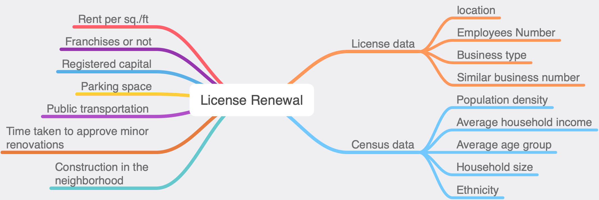

```{r setup, include=FALSE}
knitr::opts_chunk$set(echo = FALSE)
library(tidyverse)
library(leaflet)
library(rgdal)
bus_licence_19_20_office <- rgdal::readOGR("../data/business_licence_pres.geojson")
```

## Goal of the Project
- Understand how Vancouver business's have evolved in the past
- How they may change in future?
- Can this information be used to drive decision making?

## Research Questions
- How long will a particular Vancouver based business stay in operation?
- Geospatial summary of Vancouver's business landscape

## Dataset Overview
- Licence dataset from 1997 to 2020
  - Business type 
  - Location
  - Number of employees
  - Number of similar business (after wrangle)
  
  **insert plot for dataset here**


## Dataset Overview
- Census local area profile
  - Population density
  - Average household income
  - Average age group
  - Household size
  - Ethnicity
  
  **insert plot for dataset here**
  
## Potential Future Dataset(s)
 
```{r, out.width = "800px"}

```  
  
## Data Science Techniques
  - Data synthesis
  - Modeling using Postgres
  - Baseline model: 
    - Logistic regression
  - Advance modeling: 
    - Machine Learning and Simulations
  - Further direction: 
    - Survival analysis
  - Geospatial visualization:
    - Python and Altair/Leaflet
  - Deploy with Dash on Heroku
  
## Potential Difficulties
- Identify and address any existing geospatial and temporal correlation between the variables
- Current variables may be proxies
  - Number of employees -> Captial invested
- Combine features from different data sources

## Final Product
- A data pipeline
- A geospatial visualization of Vancouver's business landscape

<style>
.leaflet-control-layers-selector {
  width: auto;
}
</style>

```{r final_prod, fig.cap="Descriptive and Simulated Information on Map"}
bus_licence_19_20_office %>%
  leaflet(width=800, height=400) %>%
  addTiles() %>%
  addMarkers(clusterOptions = markerClusterOptions()) %>%
  addLayersControl(
    baseGroups = c("Office", "Health Services", "Animal Services", "Retail Dealer", "Computer Services",
                   "Financial Services", "Short-Term Rental", "One-Family Dwelling"),
    overlayGroups = c("Downtown", "Kitsilano", "Fairview", "Mount Pleasant", "West End", "Oakridge"),
    options = layersControlOptions(collapsed = TRUE)
  )
```

<div class="notes">
Final product will be designed to answer both research questions effectively.
  - Vancouver map to show all descriptive information
  - Side panel to show modeling results
</div>

## Timeline (Week 1 - 2)

**Hackathon and Proposal**

```{r timeline12, warning = FALSE}
week1_2 <- data.frame("Capstone_Dates" = c("May 4-8", "May 8", "May 11-15", "May 12", "May 15"),
           "Deliverables" = c("", "Proposal Presentation", "", 
                              "Proposal Report to Mentor",
                              "Proposal Report to Deetken"),
           "Objectives" = c("1. Prepare proposal presentation<br> 2. Setup GitHub repository",
                            "",
                            "1. Prepare proposal report<br>2. EDA<br>3. Finalize form of final product", 
                            "", ""))

knitr::kable(week1_2, format = "pandoc")
```

<div class="notes">
EDA
  - Data cleaning, wrangling, combining features from different datasets
  - Reproducible fashion (updates on open data portal can be fed into pipeline easily)
  - Decide visualization tool
</div>

## Timeline (Week 3 - 4)

**Launch Project, Develop ML Model, and Build Visualization**

```{r timeline34, warning = FALSE}
week3_4 <- data.frame("Capstone_Dates" = c("May 18-22", "May 20", "May 25-29"),
           "Deliverables" = c("", "Meeting with Deetken", ""),
           "Objectives" = c("1. Incorporate feedbacks on proposal<br>2. Launch project (modeling and visualization)",
                            "",
                            "1. Develop machine learning model <br>2. Develop geo-spatial visualization"))

knitr::kable(week3_4, format = "pandoc")
```

<div class="notes">
Launch project
  - Incorporate feedbacks on proposal from both mentor and Deetken
  - Start building models and visualization
</div>

## Timeline (Week 5 - 6)

**Fine-tuning**

```{r timeline56, warning = FALSE}
week5_6 <- data.frame("Capstone_Dates" = c("Jun 1-12"),
           "Deliverables" = c(""),
           "Objectives" = c("1. Fine-tuning of model and visualization<br>2. Update documentations or user manual for the end product"))

knitr::kable(week5_6, format = "pandoc")
```

<div class="notes">
A crucial point to check what we have done, what we found difficult to do, decidie the direction to move forward and next steps to take for a better product.
</div>

## Timeline (Week 7 - 9)

**Final Stage**

```{r timeline79, warning = FALSE}
week7_9 <- data.frame("Capstone_Dates" = c("Jun 18-19", "Jun 22-26", "Jun 23", "Jun 29", "Jun 30"),
           "Deliverables" = c("Final Presentation", "", "Final Report and Product to Mentor",
                              "Final Report and Product to Deetken", "Teamwork Reflection"),
           "Objectives" = c("Prepare for final presentation",
                            "Prepare final report",
                            "Modify based on feedbacks from mentor", 
                            "Final presentation to Deetken", ""))

knitr::kable(week7_9, format = "pandoc")
```

<div class="notes">
- Wrap-up everything and prepare for final presentation (MDS and Deetken)
- Reflect back, summarize all we've done, and celebrate!
</div>

## Thank you! 

**Questions?**