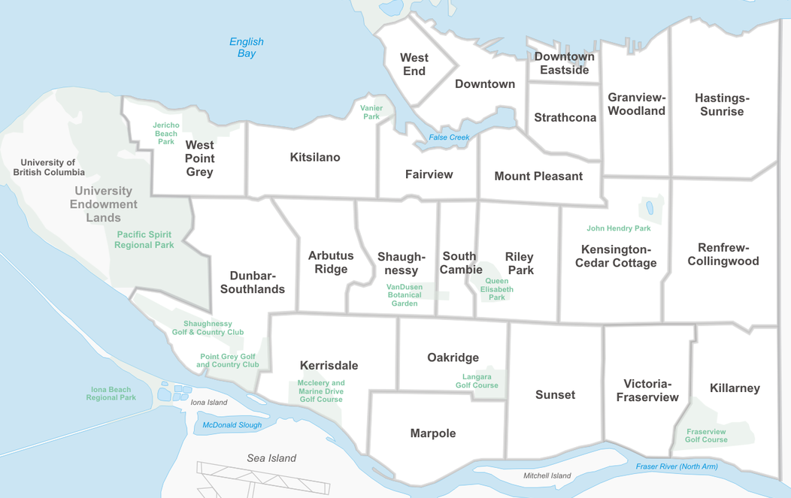
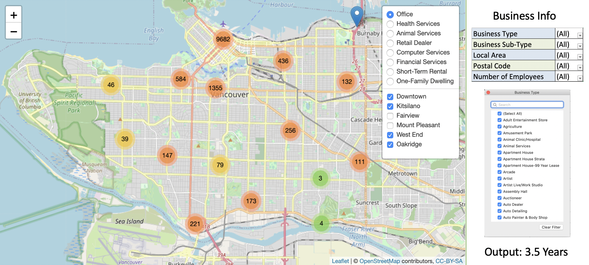

```{r setup, include=FALSE}
knitr::opts_chunk$set(echo = FALSE)
library(tidyverse)
```

## Goal of the project
- Understand how Vancouver business's have evolved in the past
- How they may change in future?
- Can this information be used to drive decision making?

## Research Question
- How long will a particular Vancouver based business stay in operation?
- Geospatial summary of Vancouver's business landscape

## Dataset Overview
- **Licence dataset from 1997 to 2020**
  - Business type 
  - Location
  - Number of employees

```{r, message=FALSE, comment=FALSE, echo=FALSE, warning=FALSE, error=FALSE, fig.width=8, fig.height=3.5}

#read in dataset
all_licences_group <- read_csv("../data/processed/licences.csv")

# filter for smaller dataset
filtered_df <- all_licences_group %>% 
  filter(BusinessType %in% c('Health Services', 'Landscape Gardener', 'Computer Services', 'Animal Services')) %>% 
  filter(LocalArea %in% c('Arbutus-Ridge', 'Downtown', 'Fairview', 'Kitsilano'))

# plot counts of business types by area
filtered_df %>% ggplot() + 
  geom_bar(aes(x=filtered_df$BusinessType, 
               fill=filtered_df$BusinessType),
           show.legend = FALSE) +
    labs(x='Business Type', 
       y='Count', 
       title = "Counts of Business Types in Vancouver Neighbourhoods",
       caption = "Data Source: opendata.vancouver.ca     ") +
  facet_grid(.~filtered_df$LocalArea) +
  theme(axis.text.x = element_text(angle = 25,hjust = 1),
        panel.border = element_blank(),
        panel.background = element_blank(),
        panel.grid.major = element_blank(),
        panel.grid.minor = element_blank(), 
        axis.line = element_line(colour = "black")) 
```

<div class="notes">
- Our main dataset we will utilize in this project comes from the Vancouver Open Data Catalog
- This dataset is spread across two files and consists of all Vancouver Business Licence 
applications from 1997 to current
- The most prominent features in this dataset are the business type, the business location, and number of employees
- After wrangling the data, we also expect to extract additional features 
such as, the number of similar business in the surrounding area 
- The bar plot shown on this slide is from a small subset of the data, it visualizes the number of different businesses by type and neighbourhood
</div>


## Dataset Overview
- **Census local area profile**
  - Population density
  - Average household income
  - Average age group
  - Ethnicity
  
```{r, out.height="280px",fig.align='center'}

```
<font size="2">
  [Wikipedia Commons: Vancouver_2008.png](https://upload.wikimedia.org/wikipedia/commons/thumb/3/37/Stadtgliederung_Vancouver_2008.png/1200px-Stadtgliederung_Vancouver_2008.png)
</font>

## Potential future dataset(s)
  - Access to public transportation 
  - Parking space
  - Rent per sq./ft 
  - Construction in the neighbourhood
  - Time taken to approve minor renovations
  - Registered capital
  - Franchise or not
  
## Data Science Technique(s)
  - Data wrangling and database creation using Postgres
  - Baseline model: 
    - Logistic regression
  - Advance modeling: 
    - Random forest, Regularization
  - Further direction: 
    - Survival analysis
  - Geospatial visualization:
    - Python and Altair/Leaflet
  - Deploy with Dash on Heroku
  
## Potential difficulties
- Identify and address any existing temporal correlation between the variables
- Current variables may be proxies
- Combine features from different data sources

## Final product
- A data pipeline
- A geospatial visualization of Vancouver's business landscape

```{r, out.width = "800px"}

```

## Timeline (Week 1 - 2)
 
**Hackathon and Proposal**

|Dates   |Deliverables   |Objectives   |
|---|---|---|
|May 4 - 8   |   |1. Prepare proposal presentation<br> 2. Setup GitHub repository, prepare data downloading script and data dictionary  |
|May 8   |Proposal Presentation   |   |
|May 11 - 15   |   |1. Prepare proposal report<br>2. EDA<br>3. Finalize form of final product   |
|May 12   |Proposal Report to Mentor   |   |
|May 15   |Proposal Report to Deetken   |   |

## Timeline (Week 3 - 4)

**Launch Project, Develop ML Model, and Build Visualization**

|Dates   |Deliverables   |Objectives   |
|---|---|---|
|May 18 - 22   |   |1. Incorporate feedbacks from mentor and Deetken on proposal<br>2. Launch project (both modeling and visualization part)   |
|May 20   |Meeting with Deetken   |   |
|May 25 - 29   |   |Develop machine learning model and geo-spatial visualization   |


## Timeline (Week 5 - 6)

**Fine-tuning**

|Dates   |Deliverables   |Objectives   |
|---|---|---|
|Jun 1 - 12   |   |1. Fine-tuning of model and visualization<br>2. Update documentations or user manual for the end product   |

## Timeline (Week 7 - 9)

**Final Stage**

|Dates   |Deliverables   |Objectives   |
|---|---|---|
|Jun 15 - 19   |   |Prepare for final presentation   |
|Jun 18 - 19   |Final Presentation   |   |
|Jun 22 - 26   |   |Prepare final report and end data product   |
|Jun 23   |Final report and Product to Mentor   |Modify based on feedbacks from mentor   |
|Jun 29    | Final Report and Product to Deetken   |Final presentation to Deetken   |
|Jun 30   |Teamwork Reflection   |   |


## Thank you! 

**Questions?**


