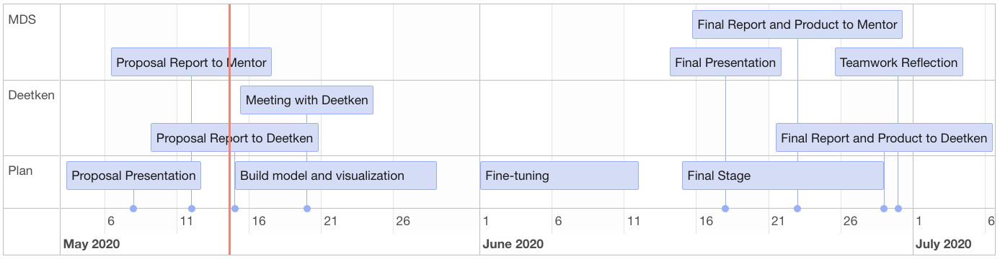

```{r setup, include=FALSE}
knitr::opts_chunk$set(echo = FALSE)
library(tidyverse)
library(leaflet)
library(rgdal)
library(timevis)

## Data set-up: in terminal, run:
# python3 src/01_download_data.py --file_path="data/raw" --urls="[(business_licence_pres.geojson, https://opendata.vancouver.ca/explore/dataset/business-licences/download/?format=geojson&disjunctive.status=true&disjunctive.businesssubtype=true&refine.folderyear=19&refine.businesstype=Office&timezone=America/Los_Angeles&lang=en)]"

bus_licence_19_20_office <- rgdal::readOGR("../../data/raw/business_licence_pres.geojson")
```

## Executive summary

Our proposal introduces the context of the capstone project provided by Deetken. The problem statement is refined into quantifiable data science research questions. We then further deep dive into relevant data sets, elaborate on analysis methodologies, and propose final deliverable.

## Introduction

With government expenditures totalling 40% of the Gross Domestic Product and public organizations accounting for 20% of the country’s employment, the Canadian public sector has established itself as a pillar in the national economy. Due to its importance and potential for impact, it is critical that the public sector operates in an efficient and transparent manner.  Accessible public data portals (e.g., Vancouver Open Data), in conjunction with data science techniques, represent one approach to address these demands.

In particular, the current socio-economic environment in Vancouver presents the challenge of balancing significant budgetary constraints with the increasing demand for medical and social services. Developing an understanding of how Vancouver’s business landscape has evolved over time can help mitigate this challenge and gain insight on how to most how to most efficiently allocate the city’s resources and services. 

All businesses operating in the city of Vancouver must have a valid business licence which is required to be renewed every calendar year. As such, this dataset represents a yearly snapshot of the entire Vancouver business landscape. The renewal of business licences provides information regarding the spatial distribution, the temporal trends, and the volatility of businesses across Vancouver’s neighbourhoods. While business licence renewal takes place on the individual scale, it is influenced by broader regional factors, such as the proximity to public transport, the demographics of the neighbourhood, and the national economic health. 

```{r end_prod, fig.cap="Descriptive and Simulated Information on Map", include=TRUE, out.width="400px", out.height="200px",  fig.align="center"}
content <- paste(sep = "<br/>",
  "<b><a href='https://opendata.vancouver.ca/'>Input: </a></b> Health Services",
  "Number of Employees: 3",
  "Local Area: Dunbar-Southlands",
  "Household Size:",
  "2 persons: 2485",
  "3 persons: 1445",
  "4 persons: 1620",
  "5+ persons: 495",
  "<b><a href='https://opendata.vancouver.ca/'>Renewal Probability: </a></b> 0.75"
)

demo <- bus_licence_19_20_office %>%
  leaflet(width=800, height=400) %>%
  addTiles() %>%
  addMarkers(clusterOptions = markerClusterOptions()) %>%
  addLayersControl(
    baseGroups = c("Health Services", "Office", "Animal Services", "Retail Dealer", "Computer Services",
                   "Financial Services", "Short-Term Rental", "One-Family Dwelling"),
    overlayGroups = c("Downtown", "Kitsilano", "Fairview", "Mount Pleasant", "West End", "Oakridge"),
    options = layersControlOptions(collapsed = FALSE)
  ) %>%
  addPopups(-123.19, 49.24, content,
    options = popupOptions(closeButton = FALSE)
  ) %>% 
  setView(-123.14, 49.25, 12)

knitr::include_graphics("../../figures/end_prod_prop.png")
```

This proposal focuses on developing insight into Vancouver’s business landscape which can be leveraged by policy-makers, planners, business owners, and others to improve efficiency. To achieve this we have established two main research objectives. (1) We will predict whether a business will renew its license, given a set of underlying factors. Given a reasonable set of factors drawn from public data, we can also begin to interpret the model output to provide (2) a broader geospatial summary of the evolution of Vancouver's business landscape. 

The proposed final product consists of a data pipeline as well as a geospatial visualization of Vancouver's business landscape. Users will be able to locate a specific zone on the interactive map and view relevant descriptive information for a given year, such as business type distribution and census data [**figure 1**]. The data pipeline will pass processed input data of a specific business to a machine learning model and produce a predicted renewal probability.

## Data Science Techniques

### Data Sources

The primary dataset utilized in this project consists of all Vancouver Business Licence applications from 1997 to the current date. This data is made available as part of the city of Vancouver’s Open Data Portal and regulated under the terms of the Open Government Licence – Vancouver. The most pertinent features present in this dataset are business type, location, and number of employees.

In addition to the business licence dataset, the Canadian census surveys provide another important source of data for this project. The census data is hosted on the Vancouver Open Data Portal and provides demographic information such as population density, average income, age distribution, and ethnicity. The current census dataset aggregates the demographic data by Vancouver neighbourhoods. As the project progresses, we may choose to further refine our model by obtaining census data aggregated at the postal code level.

Possible Data Sources

| Data | Explanation | Spatial Scale | Temporal Scale |
|-----|-----|-----|-----|
| [Business License 1997-2012](https://opendata.vancouver.ca/explore/dataset/business-licences-1997-to-2012)| Business information and its license status for business in Vancouver area  | Point location  | Annual  |
| [Business License 2013-current](https://opendata.vancouver.ca/explore/dataset/business-licences)   | Business information and its license status for business in Vancouver area  | Point location  | Annual  |
| [Census Local Area Profile 2016](https://opendata.vancouver.ca/explore/dataset/census-local-area-profiles-2016)   | Census information in Vancouver  | Local District  | Annual  |
| [Census Local Area Profile 2011](https://opendata.vancouver.ca/explore/dataset/census-local-area-profiles-2011)   | Census information in Vancouver  | Local District  | Annual  |
| [Census Local Area Profile 2006](https://opendata.vancouver.ca/explore/dataset/census-local-area-profiles-2006)  | Census information in Vancouver  | Local District  | Annual  |
| [Census Local Area Profile 2001](https://opendata.vancouver.ca/explore/dataset/census-local-area-profiles-2001)   | Census information in Vancouver  | Local District  | Annual  |
| [Local Area Boundary](https://opendata.vancouver.ca/explore/dataset/local-area-boundary)   | Geospatial boundary for Vancouver 22 local area  | Local District  |Not Applicable  |
| [Disablibity Parking](https://opendata.vancouver.ca/explore/dataset/disability-parking)   | Location for disability parking space  |Point Location  | Not Applicable  |
| [Parking Meters](https://opendata.vancouver.ca/explore/dataset/parking-meters)  | Parking meters location and rate in Vancouver  |Point Location  | Not Applicable  |
| [Business Improvement Area](https://opendata.vancouver.ca/explore/dataset/business-improvement-areas-bia) | Area where business join together to promote commercial viability of their district   | Local District  |Not Applicable |


### Methodologies

Synthesizing information across different data sources is a crucial initial step shared by both proposed research questions. It can provide an integrated summary of the business landscape by adding demographics and other social components and allows us to build a more valuable predictive model for renewal probability. The main difficulty in this stage is the different temporal and spatial scales among the collected datasets. For example, licences are applied annually and locations can be pinpointed on map, whereas census profile is collected every 5 years and aggregated to neighbourhood level. The best solution is to interpolate census data for a given year and build spatial configuration around an individual business. Additionally, due to the size of the datasets, we will use a Postgres database to store the processed data.  
    
After processing the data, we will proceed with building a baseline model using logistic regression. We choose logistic regression as it can produce a probability distribution of the predicted result, affording greater insight to the clients. Once as the baseline model has been established, we will implement regularization techniques to mitigate overfitting and model complexity. We may also draw on techniques from survival analysis to examine business renewal over extended periods. In parallel with the development of predictive models, we will also create a visualization to display geospatial information using Python and deploy the result.

The datasets pose some potential difficulties for us. First, we need to identify and address temporal and geospatial correlation between the variables. Moreover, some variables may be proxies for underlying factors that are not included in the model. For example, number of employees in the licence dataset might be a significant predictor. However, capital invested might actually be the lurking factor that is affecting both number of employees and success probability.


## Timeline

```{r timeline, include=FALSE}
timeline <- data.frame(
  id = 1:11,
  content = c("Build model and visualization", "Fine-tuning", "Final Stage",
              "Proposal Report to Deetken", "Meeting with Deetken", "Final Report and Product to Deetken",
              "Proposal Presentation", "Proposal Report to Mentor", "Final Presentation", "Final Report and Product to Mentor", "Teamwork Reflection"),
  start = c("2020-05-15", "2020-06-01", "2020-06-15", "2020-05-15", "2020-05-20", 
            "2020-06-29", "2020-05-08", "2020-05-12", "2020-06-18", "2020-06-23", "2020-06-30"),
  end = c("2020-05-29", "2020-06-12", "2020-06-29", NA, NA, NA, NA, NA, NA, NA, NA),
  group = c(3, 3, 3, 2, 2, 2, 3, 1, 1, 1, 1)
)

groups = data.frame(
  id = c(1, 2, 3),
  content = c("MDS", "Deetken", "Plan")
)
```

```{r timelineimage, out.width="500px", out.height="300px", echo=FALSE}

```
